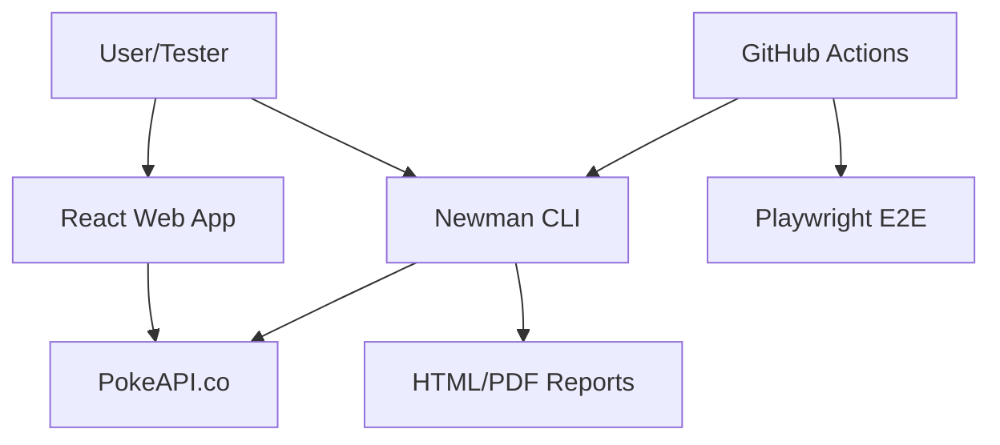

# Pokédex App

A modern, responsive Pokédex application built with React, TypeScript, and Tailwind CSS, powered by the [PokeAPI](https://pokeapi.co/).

## 🚀 Features

- **Browse Pokémon**: View a list of Pokémon with their official artwork and types.
- **Search**: Real-time search to find your favorite Pokémon by name.
- **Pagination**: Navigate through the extensive list of Pokémon (20 per page).
- **Detailed View**: Click on any Pokémon to see its height, weight, and base stats with visual progress bars.
- **Responsive Design**: optimized for desktop, tablet, and mobile screens.
- **E2E Testing**: Comprehensive test suite using Playwright.

## 🛠 Tech Stack

- **Framework**: [React 19](https://react.dev/)
- **Build Tool**: [Vite](https://vite.dev/)
- **Language**: [TypeScript](https://www.typescriptlang.org/)
- **Styling**: [Tailwind CSS](https://tailwindcss.com/)
- **Icons**: [Lucide React](https://lucide.dev/)
- **Testing**: [Playwright](https://playwright.dev/)

## 🏃‍♂️ How to Run the Project

### Prerequisites

Ensure you have [Node.js](https://nodejs.org/) installed (v18 or higher recommended).

### Installation

1. Clone the repository (if applicable) or navigate to the project folder:
   ```bash
   cd pokemon-app
   ```

2. Install dependencies:
   ```bash
   npm install
   ```

3. Install Playwright browsers:
   ```bash
   npx playwright install
   ```

### Running Development Server

Start the local development server:
```bash
npm run dev
```
The app will be available at `http://localhost:5188` (or the port specified in the console).

### Building for Production

To create a production build:
```bash
npm run build
```

---

## 🧪 Testing with Playwright

We use Playwright for end-to-end testing to ensure the application works as expected.

### Running Tests

1. Ensure the development server is NOT running (Playwright will start its own):
   ```bash
   npx playwright test
   ```

2. To run tests in UI mode:
   ```bash
   npx playwright test --ui
   ```

3. To view the last test report:
   ```bash
   npx playwright show-report
   ```

### Testing Results Summary
Our test suite covers:
- **Positive Scenarios**: Home page loading, search functionality, pagination, and detail page navigation.
- **Negative Scenarios**: Proper handling of "not found" states for invalid searches.

---

## 🧪 API Testing with Newman

We use Newman (Postman CLI) for API automation testing.

### Running API Tests

1. Navigate to the project folder:
   ```bash
   cd pokemon-app
   ```

2. Run the Postman collection:
   ```bash
   npm run test:postman
   ```

3. View reports:
   - HTML Report: `qa/report.html`
   - PDF Report: `qa/report.pdf`

---

## 🏗 Architecture Diagram



---

## 📁 Project Structure

- `src/App.tsx`: Main application component containing all logic and UI.
- `src/types.ts`: TypeScript interfaces for PokeAPI data.
- `src/index.css`: Global styles and Tailwind directives.
- `tests/pokemon.spec.ts`: Playwright E2E test suite.
- `playwright.config.ts`: Configuration for Playwright testing.
- `vite.config.ts`: Configuration for the Vite build tool.

### Running E2E Tests (Playwright)

Run the automated UI tests:
```bash
npx playwright test
```

### Running API Tests (Postman/Newman)

Run the automated API tests using Newman:
```bash
npm run test:postman
```
The tests are located in the `qa/` folder. Detailed reports are generated after execution:
- **HTML Report**: `qa/report.html`
- **PDF Report**: `qa/report.pdf`
